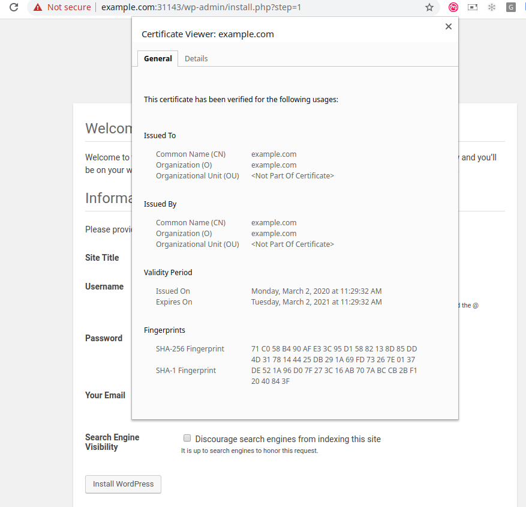

# 3-Tier Application: Nginx ingress + Wordpress + MySQL

## Create a Kubernetes cluster

Using KIND v0.7.0 or greater create a cluster:

```sh
cd nginx-wordpress-mysql/
kind create cluster --config ../kind-config.yaml
Creating cluster "kind" ...
 ✓ Ensuring node image (kindest/node:v1.17.2) 🖼
 ✓ Preparing nodes 📦 📦 📦  
 ✓ Writing configuration 📜 
 ✓ Starting control-plane 🕹️ 
 ✓ Installing CNI 🔌 
 ✓ Installing StorageClass 💾 
 ✓ Joining worker nodes 🚜 
Set $ kubectl context to "kind-kind"
You can now use your cluster with:

$ kubectl cluster-info --context kind-kind

Thanks for using kind! 😊
```

and check it's status:

```sh
$ kubectl get nodes -o wide
NAME                 STATUS   ROLES    AGE     VERSION   INTERNAL-IP   EXTERNAL-IP   OS-IMAGE       KERNEL-VERSION    CONTAINER-RUNTIME
kind-control-plane   Ready    master   5m1s    v1.17.2   172.17.0.4    <none>        Ubuntu 19.10   5.5.4-1-default   containerd://1.3.2-31-gaa877d78
kind-worker          Ready    <none>   4m19s   v1.17.2   172.17.0.5    <none>        Ubuntu 19.10   5.5.4-1-default   containerd://1.3.2-31-gaa877d78
kind-worker2         Ready    <none>   4m20s   v1.17.2   172.17.0.3    <none>        Ubuntu 19.10   5.5.4-1-default   containerd://1.3.2-31-gaa877d78
```

Preload the docker images needed in the cluster to avoid pulling them from Internet:

```sh
IMAGES="mysql:5.7 wordpress:4.8-apache quay.io/kubernetes-ingress-controller/nginx-ingress-controller:0.30.0"
for i in $IMAGES; do
    docker pull $i
    kind load docker-image $i
done
```

## Deploy a MySQL database

This example is based on the official documentation example [Run a Replicated Stateful Application](https://kubernetes.io/docs/tasks/run-application/run-replicated-stateful-application/), however it use [Secrets](https://kubernetes.io/docs/concepts/configuration/secret/) to store sensitive information like passwords.

All the configuration details are explained in the document above.

1. Create the Secrets with the MySQL users and passwords:

```sh
$ kubectl apply -f 10-mysql-secret.yaml 
secret/mysql-pass-root created
secret/mysql-pass-user created
```

2. Create the ConfigMaps with the MySQL configuration:

```sh
$ kubectl apply -f 11-mysql-configmap.yaml 
configmap/mysql created
```

3. Create the MySQL headles services to provide DNS entries for the Pods:

```sh
$ kubectl apply -f 12-mysql-services.yaml 
service/mysql created
service/mysql-read created
```

4. Create the MySQL statefulset and wait until it's ready:

```sh
$ kubectl apply -f 15-mysql-statefulset.yaml 
statefulset.apps/mysql created
```

You can observe how the statefulset pods are created sequentially:

```sh
$ kubectl get pods -l app=wordpress,tier=mysql --watch
NAME      READY   STATUS     RESTARTS   AGE
mysql-0   0/2     Init:0/2   0          53s
mysql-0   0/2     Init:1/2   0          73s
mysql-0   0/2     PodInitializing   0          2m3s
mysql-0   1/2     Running           0          2m4s
mysql-0   2/2     Running           0          2m19s
mysql-1   0/2     Pending           0          0s
mysql-1   0/2     Pending           0          3s
mysql-1   0/2     Init:0/2          0          3s
mysql-0   2/2     Running   0          5m8s
mysql-1   2/2     Running   0          2m49s
```

And the Pods have Persistent Volumes associated:

```sh
$ kubectl get pv
NAME                                       CAPACITY   ACCESS MODES   RECLAIM POLICY   STATUS   CLAIM                  STORAGECLASS   REASON   AGE
pvc-5d5c894b-956e-433f-94ec-438db8c1990d   1Gi        RWO            Delete           Bound    default/data-mysql-1   standard                113s
pvc-8cd2ab25-4b5c-4b02-ac14-ed80b2a19849   1Gi        RWO            Delete           Bound    default/data-mysql-0   standard                4m12s

$ kubectl get pvc
NAME           STATUS   VOLUME                                     CAPACITY   ACCESS MODES   STORAGECLASS   AGE
data-mysql-0   Bound    pvc-8cd2ab25-4b5c-4b02-ac14-ed80b2a19849   1Gi        RWO            standard       4m17s
data-mysql-1   Bound    pvc-5d5c894b-956e-433f-94ec-438db8c1990d   1Gi        RWO            standard       117s
```

Check that the database works (the user and password are the ones we have stored in the Secrets), create a test database:

```sh
$ kubectl run mysql-client --image=mysql:5.7 -i --rm --restart=Never --  mysql -h mysql-0.mysql -uroot -pMYPASSWORD <<EOF
CREATE DATABASE test;
CREATE TABLE test.messages (message VARCHAR(250));
INSERT INTO test.messages VALUES ('hello');
EOF
If you don't see a command prompt, try pressing enter.
pod "mysql-client" deleted
```

and check it has been created:

```sh
$ kubectl run mysql-client --image=mysql:5.7 -i -t --rm --restart=Never --  mysql -h mysql-read -uroot -pMYPASSWORD -e "SELECT * FROM test.messages"
mysql: [Warning] Using a password on the command line interface can be insecure.
+---------+
| message |
+---------+
| hello   |
+---------+
pod "mysql-client" deleted
```

We can use this method to do more MySQL operations like listing current databases per example, the pod client is deleted after the command is executed:

```sh
$ kubectl run mysql-client --image=mysql:5.7 -i -t --rm --restart=Never --  mysql -h mysql-read -uroot -pMYPASSWORD -e "show databases"
mysql: [Warning] Using a password on the command line interface can be insecure.
+------------------------+
| Database               |
+------------------------+
| information_schema     |
| mysql                  |
| performance_schema     |
| sys                    |
| test                   |
| wordpress              |
| xtrabackup_backupfiles |
+------------------------+
pod "mysql-client" deleted
```

## OPTIONAL: Instal phpmyadmin to manage the MySQL database

```sh
$ kubectl apply -f 19-phpmyadmin.yaml 
deployment.apps/phpmyadmin-deployment created
```

Expose the deployment

```sh
$ kubectl expose deployment phpmyadmin-deployment --type=NodePort
service/phpmyadmin-deployment exposed

$ kubectl get service phpmyadmin-deployment
NAME                    TYPE       CLUSTER-IP      EXTERNAL-IP   PORT(S)        AGE
phpmyadmin-deployment   NodePort   10.106.54.146   <none>        80:30308/TCP   8s
```

and access the service, in this case, in the URL http://172.17.0.4:30308

## Install and Configure Wordpress

Now that we have the MySQL running we can launch the Wordpress application, the manifest creates a deployment with a single replica, a service and a persistent volume to store permanent data:

```sh
$ kubectl apply -f 20-wordpress-deployment.yaml 
service/wordpress created
persistentvolumeclaim/wp-pv-claim created
deployment.apps/wordpress created
```

As we did before, we can watch the status, because it takes some time to pull the container images:

```sh
$ kubectl get pods -l app=wordpress --watch
NAME                         READY   STATUS    RESTARTS   AGE
mysql-0                      2/2     Running   0          45m
mysql-1                      2/2     Running   0          43m
wordpress-5d4f8f4477-xhhsn   1/1     Running   0          7s
```

## TLS Termination

The remaining step will be adding TLS termination to your Wordpress application.

We are going to use the [Nginx-Ingress Controller](https://kubernetes.github.io/ingress-nginx/)

1. Install the Nginx-Ingress controller

```sh
$ kubectl apply -f 30-ingress-nginx.yaml 
namespace/ingress-nginx created
configmap/nginx-configuration created
configmap/tcp-services created
configmap/udp-services created
serviceaccount/nginx-ingress-serviceaccount created
clusterrole.rbac.authorization.k8s.io/nginx-ingress-clusterrole created
role.rbac.authorization.k8s.io/nginx-ingress-role created
rolebinding.rbac.authorization.k8s.io/nginx-ingress-role-nisa-binding created
clusterrolebinding.rbac.authorization.k8s.io/nginx-ingress-clusterrole-nisa-binding created
deployment.apps/nginx-ingress-controller created
limitrange/ingress-nginx created
```

2. Create a TLS Secret:

```sh
KEY_FILE=example.key
CERT_FILE=example.crt
HOST=example.com
openssl req -x509 -nodes -days 365 -newkey rsa:2048 -keyout ${KEY_FILE} -out ${CERT_FILE} -subj "/CN=${HOST}/O=${HOST}"
Generating a RSA private key
................+++++
............+++++
writing new private key to 'example.key'
-----
```

3. add it to the cluster:

```sh
KEY_FILE=example.key
CERT_FILE=example.crt
CERT_NAME=example-tls
$ kubectl create secret tls ${CERT_NAME} --key ${KEY_FILE} --cert ${CERT_FILE}
secret/example-tls
```

4. and configure the Ingress rules to use the certificate based on matching the host `example.com`:

```sh
$ kubectl apply -f 32-ingress-tls.yaml 
ingress.networking.k8s.io/nginx-test created
```

5. We need to create a service to publish our ingress so we can connect to it:

```sh
$ kubectl apply -f 35-ingress-nodeport.yaml 
service/ingress-nginx created
$ kubectl get services -n ingress-nginx
NAME            TYPE       CLUSTER-IP      EXTERNAL-IP   PORT(S)                      AGE
ingress-nginx   NodePort   10.108.88.173   <none>        80:31422/TCP,443:30428/TCP   33s
```

Following our current example, it will be published on the url https://172.17.0.4:30428

but we need to use `example.com` , so we should add a rule to our `/etc/hosts` to resolve `example.com` to that address:

```sh
sudo echo "172.17.0.4 example.com" >> /etc/hosts
```

and connecto to https://example.com:30428

We can proceed to configure our Wordpress deployment.



